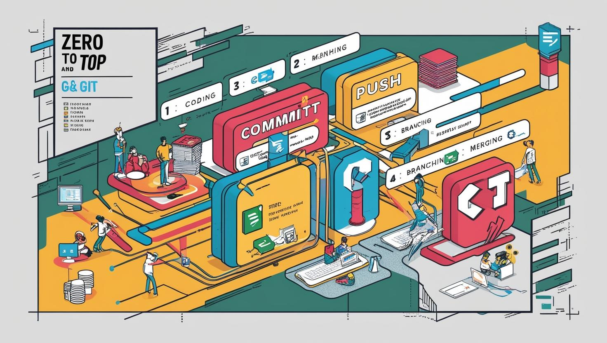

# Sıfırdan Zirveye Git ve Git Workflow

## **Modern Yazılım Geliştirme Dünyasına Git ile Adım Atın!**

Günümüzün hızla değişen teknoloji dünyasında, yazılım geliştirme süreçleri de dönüşüm geçiriyor. Git, bu dönüşümün en önemli araçlarından biri olarak, yazılım geliştirme süreçlerini hızlandırıyor ve daha verimli hale getiriyor.

Şirketlerin **Git** ve **Git workflow** tercih etmesi, modern yazılım geliştirme süreçlerinde verimlilik, iş birliği ve kaliteyi artırmaya yardımcı olur. Git ve Git workflow kullanmanın avantajları:

- **Versiyon Kontrolü:** Git, her geliştiricinin bağımsız olarak kendi kopyasında çalışmasını sağlar, ancak bu değişiklikler merkezi bir depo ile senkronize edilir. Bu, tüm yazılım geliştirme sürecinin daha güvenli ve yönetilebilir olmasını sağlar.
  
- **Dağıtık Yapı:** Git’in dağıtık yapısı sayesinde her geliştirici, kendi bilgisayarında tüm proje geçmişine erişebilir. Bu, merkezi bir sunucuya bağımlılığı ortadan kaldırır ve internet bağlantısı kesilse bile çalışmalar devam edebilir.
  
- **Branching ve Merging:** Git, birden fazla dalda (branch) paralel olarak çalışmayı ve bu dalları kolayca birleştirmeyi mümkün kılar. Bu özellik, büyük projelerdeki iş birliğini kolaylaştırır ve geliştiricilerin aynı anda farklı özellikler üzerinde çalışmalarını sağlar.
  
- **İş Birliği ve Takım Çalışması:** Git, birden fazla geliştiricinin aynı projede eş zamanlı olarak çalışmasına olanak tanır. Pull request’ler ve code review işlemleri sayesinde kod kalitesi artırılır ve hatalar minimize edilir.
  
- **Hata Takibi ve İyileştirmeler:** Git, her değişikliğin kaydını tutarak, yazılımın geçmiş sürümlerine kolayca dönmeyi ve hataları geri almayı sağlar. Bu, yazılım geliştirme sürecinde güvenliği artırır ve riskleri minimize eder.

Git ve Git workflow kullanımı, yalnızca küçük projelerde değil, büyük ölçekli yazılım projelerinde de başarıyı garantileyen bir yöntemdir. Bu nedenle, Git, günümüz yazılım geliştirme dünyasında her profesyonelin ve her şirketin vazgeçilmez bir aracı haline gelmiştir.

## **Neden Şirketler Git ve Git Workflow Tercih Etmeli**

- **1. Sürüm Kontrolü ve Tarihçe Yönetimi**  
  - **Kodun geçmişini izleme**: Git, projedeki tüm değişikliklerin kaydını tutarak, herhangi bir zamanda önceki bir sürüme dönme imkanı sağlar.  
  - **Sürümleme kolaylığı**: Yazılım sürümleri arasında geçiş yapmayı basit hale getirir.  

- **2. İş Birliğini Geliştirme**  
  - **Paralel çalışma**: Birden fazla geliştirici, aynı proje üzerinde dallar (branches) kullanarak bağımsız çalışabilir.  
  - **Merge işlemleri**: Çakışmalar kolayca çözülerek ekip üyeleri arasında uyum sağlanır.  
  - **Pull request süreçleri**: Kod incelemesi (code review) ve onay süreçleri, kaliteyi artırır ve ekip içinde bilgi paylaşımını teşvik eder.  

- **3. Dağıtık Mimari**  
  - **Bağımsız çalışma imkanı**: Git’in dağıtık yapısı sayesinde ekip üyeleri internet bağlantısı olmadan bile çalışabilir.  
  - **Merkezi olmayan yapı**: Tüm geliştiriciler yerel bir kopya üzerinde çalıştığı için sunucu kaynaklı sorunlardan etkilenme riski azalır.  

- **4. Güçlü İş Akışları (Git Workflow)**  
  - **Esnek süreçler**: Git Flow, GitHub Flow, Feature Branch gibi iş akışları, projeye uygun şekilde özelleştirilebilir.  
  - **Daha iyi sürümleme**: Özellikle sürekli entegrasyon ve dağıtım (CI/CD) süreçlerine kolayca entegre olur.  
- **5. Açık Kaynak Ekosistemi ile Uyum**  
  - **Geniş ekosistem desteği**: Git, GitHub, GitLab, Bitbucket gibi birçok platformla uyumlu çalışır.  
  - **Topluluk desteği**: Dünya genelindeki geniş geliştirici topluluğu sayesinde problem çözme ve gelişim kolaydır.  

- **6. Ölçeklenebilirlik**  
  - **Küçükten büyüğe projelere uygun**: Git, küçük bir ekiple başlayan projelerden büyük kurumsal projelere kadar ölçeklenebilir bir altyapı sunar.  
  - **Büyük kod tabanlarını yönetme**: Kodun parçalara ayrılarak dallar üzerinde yönetilmesi büyük projeleri kolaylaştırır.  

- **7. Güvenlik ve Kontrol**  
  - **Erişim kontrolleri**: Kullanıcı rolleri ve erişim seviyeleri belirlenerek, güvenli bir ortam sağlanır.  
  - **Değişikliklerin izlenebilirliği**: Kimin, ne zaman, hangi değişikliği yaptığını görmek kolaydır.  

- **8. CI/CD ile Entegrasyon Kolaylığı**  
  - **Otomatik süreçler**: GitHub Actions, GitLab CI/CD gibi araçlarla entegrasyon sayesinde kod testleri ve dağıtımı otomatik hale gelir.  
  - **Hızlı teslimat**: Kod değişiklikleri, hızlı bir şekilde üretim ortamına alınabilir.  

Git ve Git workflow, özellikle **ekip iş birliği gerektiren projeler**, **uzaktan çalışma düzenleri** ve **hızlı ürün geliştirme** süreçleri için idealdir. Hem bireysel geliştiriciler hem de büyük organizasyonlar için esnek, güvenli ve ölçeklenebilir bir çözüm sunar.  

Eğer firmanızda Git workflow kurulumu yapmayı düşünüyorsanız, **ekip üyelerine eğitim verilmesi** ve **iş akışı süreçlerinin doğru tanımlanması** başarı için kritik öneme sahiptir.

## Eğitim İçeriği

Eğitimimiz, Docker’ın temellerinden başlayarak ileri düzey uygulamalara kadar geniş bir yelpazede konuları kapsıyor. 

## **Modül 1: Git ve GitHub'a Giriş**

- **Git Nedir?**  
  - [Git’in tarihçesi ve amacı](./01-git-tarihcesi/01-01-tarihcesi-amaci.md)  
  - [Versiyon kontrol sistemlerinin temel özellikleri](./01-git-tarihcesi/01-02-versiyon-kontrol-sistemlerinin-ozellikleri.md)
- **GitHub Nedir?**  
  - [Yazılım geliştirmedeki rolü](./01-git-tarihcesi/01-03-github-yazilim-gelitirmedeki-rolu.md)
  - [Git ve GitHub arasındaki farklar](./01-git-tarihcesi/01-04-git-github-arasindaki-farklar.md)

---

## **Modül 2: Depo (Repository) Oluşturma**

- **Depoları Anlamak**  
  - [Yerel (local) ve uzak (remote) depoların farkı](./02-repository-olusturma/02-01-depolari-anlamak-local-remote.md)
- **Depo Nasıl Oluşturulur?**  
  - [Git deposu başlatma](./02-repository-olusturma/02-02-git-deposu-baslatma.md)
  - [Depoyu klonlama](./02-repository-olusturma/02-03-depoyu-klonlama.md)
  - [Uzak depo ayarları](./02-repository-olusturma/02-04-uzak-depo-eklemek.md)

---

## **Modül 3: Pull Request (Değişiklik Talebi)**

- **Pull Request Nedir?**  
  - [Ortak çalışmalardaki rolü](./03-pull-request/03-01-pull-request-nedir.md)
- **Pull Request Oluşturma**  
  - [Süreç ve en iyi uygulamalar](./03-pull-request/03-02-surec-en-iyi-uygulamalar.md)
- **Pull Request ve Fork Modeli**  
  - [Açık kaynak projelerde fork kullanımı](./03-pull-request/03-fork-kullanimi.md)

---

## **Modül 4: GitHub ile Sosyal Ağ Kullanımı**

- **GitHub’ı Sosyal Ağ Olarak Kullanmak**  
  - Takipçiler, yıldızlar ve katkılar  
- **Ekip Çalışması**  
  - Takım iş birliği için en iyi uygulamalar  

---

## **Modül 5: Depo Forklama**

- **Forklama Nedir ve Nasıl Yapılır?**  
  - Depoyu fork’lama ve klonlama adımları  
- **Fork’u Güncel Tutma**  
  - Orijinal depo ile senkronizasyon  

---

## **Modül 6: Gelişmiş Git Dallandırma Araçları**  

- **Dal (Branch) ve Birleştirme (Merge) Temelleri**  
  - Dallandırmanın kullanım senaryoları  
  - Birleştirme yöntemleri: fast-forward, 3-yönlü birleştirme, rebasing  
- **İleri Seviye Araçlar ve Teknikler**  
  - Depo arşivleme  
  - Son dalların görüntülenmesi  
  - Daha açıklayıcı dal açıklamaları oluşturma  
  - Yama setleri (patch sets) oluşturma  
  - Commit’leri bölme  
  - Commit’leri birleştirme (squashing)  
  - Commit mesajı etiketleri (örn. "fix", "feat", "chore")  
  - Commit’lerin sıralı olarak test edilmesi  

---

## **Modül 7: Değişiklik Günlüklerini (Changelog) Anlamak**

- **Değişiklik Günlükleri Nedir?**  
  - Projelerdeki rolleri  
- **Değişiklik Günlüğü Yazma Yöntemleri**  
  - Manuel ve otomatik yaklaşımlar  
- **Değişiklik Günlüğü Oluşturma Komutları**  
  - Etkili günlükler için araçlar ve şablonlar  

---

## **Modül 8: GitHub’da Dosya Yönetimi**

- **Dosya Ekleme ve Yönetme**  
  - Depoya dosya ekleme  
  - GitHub arayüzünde dosya düzenleme  
- **Değişikliklerin İzlenmesi ve Dosya Silme**  
  - `git log` ve `git diff` kullanımı  
  - Dosyaların silinmesi ve büyük dosya değişikliklerinin yönetimi  

---

## **Modül 9: GitHub Güvenliği**  

- **Kullanıcı Rolleri ve Erişim Seviyeleri**  
  - İzinler ve depo ayarları  
- **Organizasyonlar ve Takımlar**  
  - Takımların kurulumu ve izinlerin yönetimi  
- **Kimlik Doğrulama ve Şifreleme**  
  - SSH anahtarları ve 2FA kullanımı  
- **Denetim ve Erişim Günlükleri**  
  - Depo aktivitelerinin izlenmesi  
- **Uygulama Güvenliği**  
  - Dependabot ve güvenlik açıkları taraması  

---

## **Modül 10: GitHub Otomasyonu**  

- **GitHub Actions’a Giriş**  
  - İş akışlarının otomasyonu  
- **Otomatik İş Akışları Oluşturma**  
  - `.yml` dosyaları yazma  
  - CI/CD pipeline örnekleri  

---

---

Tüm eğitimlerin listesine aşağıdaki linkten ulaşabilirsiniz.

[Tüm eğitim içeriklerimiz için sürekli güncellenen eğitim repomuza göz atabilirsiniz](https://github.com/TuncerKARAARSLAN-VB/training-contents)

## **Neden Bu Eğitimi Seçmelisiniz?**

- **Uygulamalı Öğrenim:**  
  Bu eğitimde, teorik bilginin yanı sıra gerçek dünya senaryolarına uygun uygulamalar yaparak öğrendiklerinizi pekiştireceksiniz. Her modül, pratik çalışmalar ve gerçek projelerle desteklenmektedir.  

- **Deneyimli Eğitmenler:**  
  Alanında uzman eğitmenlerimiz, bilgi birikimlerini paylaşarak Git ve GitHub konularını kolayca kavramanızı sağlayacak. Sorularınıza birebir yanıt alarak derinlemesine öğrenme imkanı bulacaksınız.  

- **Güncel İçerik:**  
  Eğitim materyalleri, sektörün en son trendleri ve teknolojik gelişmeleri göz önüne alınarak hazırlanmıştır. Bu sayede, uygulamalarınızı modern iş akışlarına uygun hale getireceksiniz.  

- **Kapsamlı Kaynaklar:**  
  Eğitim boyunca size sunulan dökümanlar, videolar ve örnek projelerle bağımsız öğrenme sürecinizi destekleyeceğiz. Ayrıca, eğitmenlerimiz, yapay zeka araçlarını nasıl kullanabileceğinizi öğreterek sorun çözme yeteneklerinizi geliştirmenize yardımcı olacak.  

- **Geleceğe Yatırım:**  
  Git ve GitHub bilgisi, bireysel projelerden ekip çalışmalarına kadar birçok alanda fark yaratır. Bu eğitim, yazılım dünyasında kariyerinize değer katacak beceriler kazanmanızı sağlayacak.  

## **Kimler Katılmalı?**

- **Yazılım Geliştiriciler:**  
  Git ve GitHub’ı etkin kullanarak projelerinde sürüm kontrolü sağlamak ve ekip çalışmasında daha verimli olmak isteyen tüm yazılım geliştiriciler.  

- **Sistem Yöneticileri:**  
  Sistem ve altyapı yönetiminde versiyon kontrol araçlarını kullanarak konfigürasyonları takip etmek ve değişiklik yönetimini kolaylaştırmak isteyen sistem yöneticileri.  

- **DevOps Mühendisleri:**  
  CI/CD süreçlerinde Git’in rolünü anlamak, iş akışlarını optimize etmek ve iş birliği süreçlerini geliştirmek isteyen DevOps mühendisleri.  

- **Teknoloji Meraklıları:**  
  Yazılım geliştirme süreçlerini öğrenmek isteyen, teknolojiyi seven ve Git & GitHub’ı profesyonel ya da kişisel projelerinde kullanmayı hedefleyen herkes.  

- **Partner Firmalar ve İş Ortakları:**
  Kurumla birlikte projeler yürüten, yazılım geliştirme süreçlerinde Git ve GitHub bilgisiyle iş birliği ve verimliliği artırmak isteyen çözüm ortakları ve partner firmaların çalışanları.

## Kurumsal Eğitim Talepleri

Kurumsal eğitim oturumları hakkında daha fazla bilgi almak ve talepte bulunmak için lütfen bizimle iletişime geçin. Eğitim programlarımızı organizasyonunuzun ihtiyaçlarına göre özelleştirebiliriz. [GitHub](https://github.com/TuncerKARAARSLAN-VB) anasayfam veya [LinkedIn profilim](https://www.linkedin.com/in/tuncerkaraarslan/) üzerinden bize ulaşabilirsiniz.

**Eğitmenler:**

- [Tuncer KARAARSLAN](https://www.linkedin.com/in/tuncerkaraarslan/)
- [Rıfat Erdem Şahin](https://www.linkedin.com/in/rifaterdemsahin/)

